# AWS Multi-AZ High Availability Network Lab

Designed and implemented a highly available AWS network architecture across two Availability Zones with secure private workloads, bastion-based administration, outbound internet access using NAT, and failover validation using an Application Load Balancer.

---

## Architecture Overview

- 1 VPC
- 2 Availability Zones
- 2 Public Subnets
- 2 Private Subnets
- Bastion Host
- NAT Instance
- 2 Private Application Servers
- Application Load Balancer
- Target Group + Health Checks
- Security Groups + Route Tables

---

## Architecture

Internet
   │
   ▼
Application Load Balancer
   │
   ├── App-01 (Private / AZ1)
   └── App-02 (Private / AZ2)

Bastion Host (Public)
   │
   ├── SSH → App-01
   └── SSH → App-02

NAT Instance (Public)
   │
   ├── Private AZ1 outbound
   └── Private AZ2 outbound
```

---

## Security Validation

Private instances reject direct SSH access from the internet.

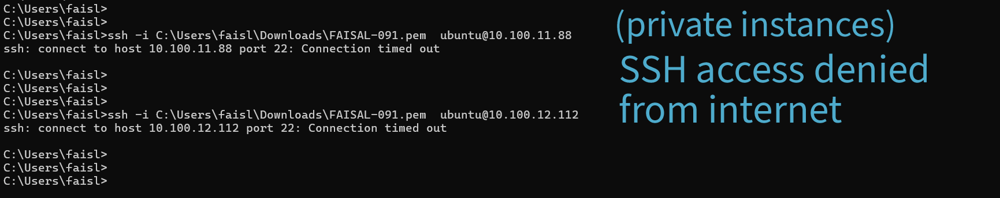

---

## Infrastructure Validation

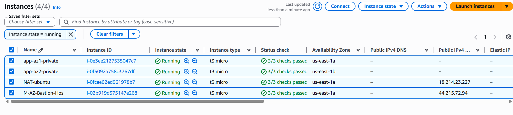

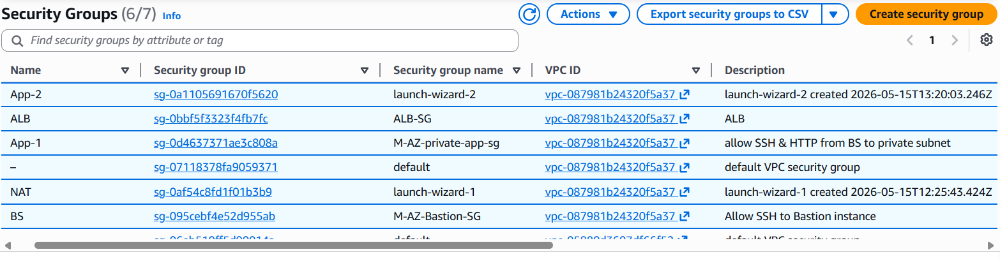


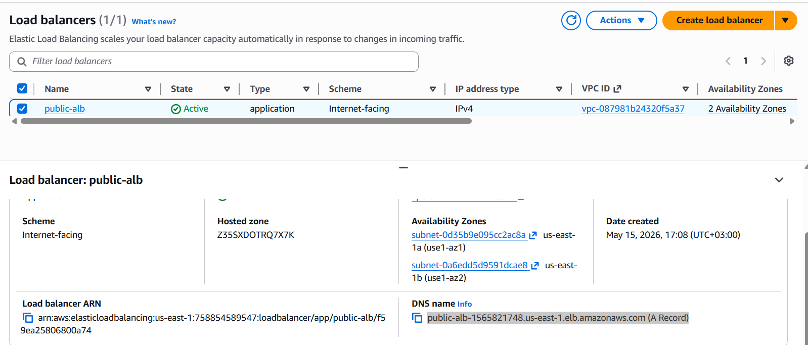

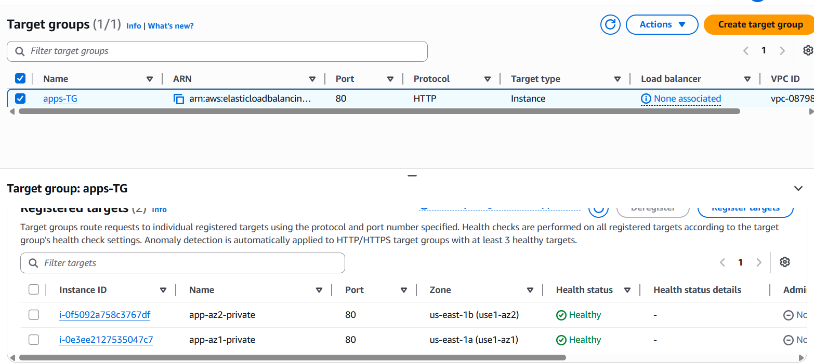

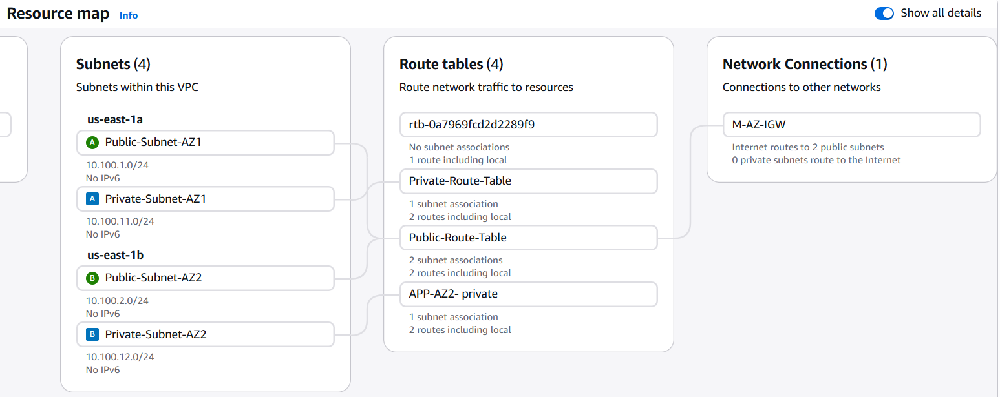

---

## Secure Administration

SSH access to private workloads is allowed only through the Bastion Host.

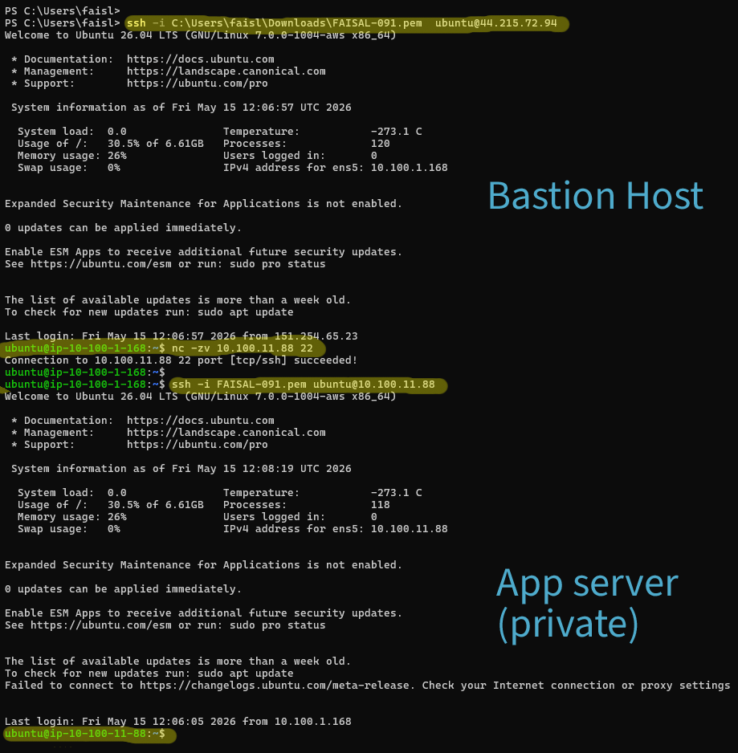

---

## Outbound Internet Access

Private workloads access the internet through the NAT instance.

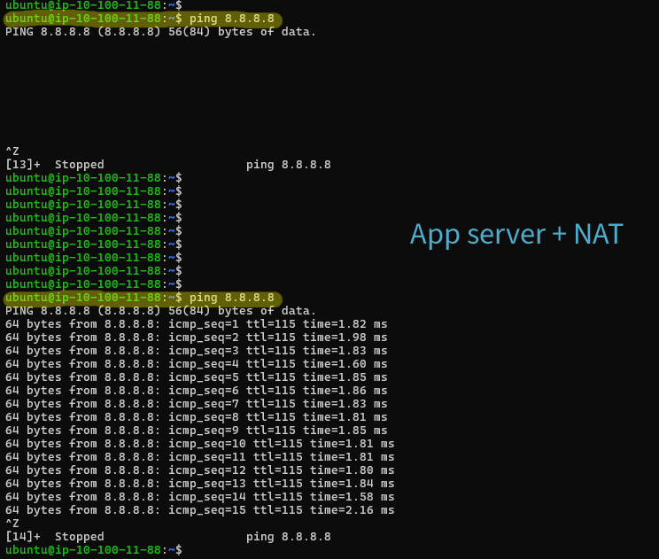

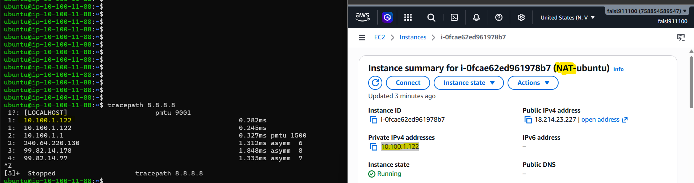

---

## Application Validation

App server in AZ1:

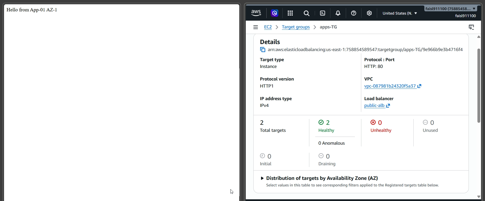

App server in AZ2:

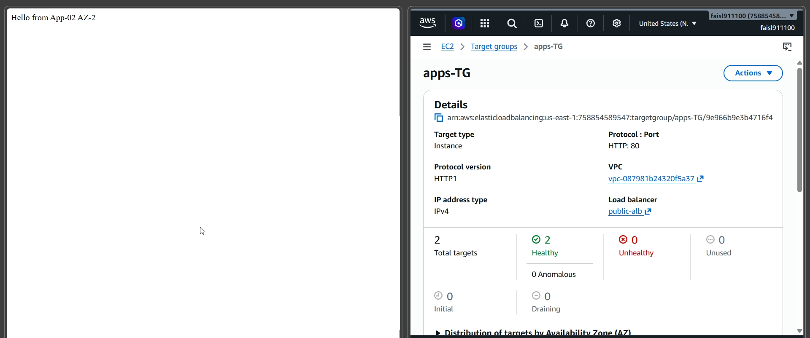

---

## High Availability Testing

Failover validation after stopping one application instance:


---

## Recovery Validation

Health checks recovered after restoring the failed instance:

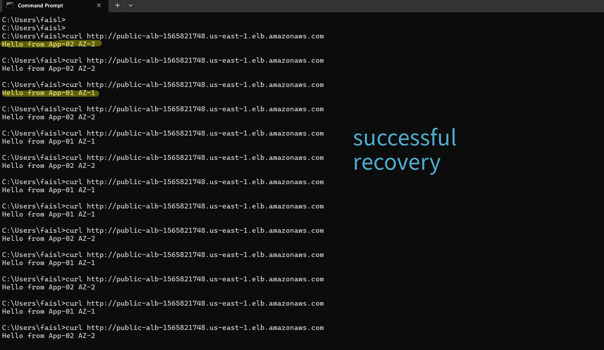

---

## Skills Demonstrated

- AWS VPC Design
- Public / Private Networking
- Security Groups
- Route Tables
- Bastion Architecture
- NAT Configuration
- Application Load Balancing
- Health Checks
- Multi-AZ Failover Testing
- Linux Administration
- SSH Troubleshooting


## Design Note
This lab uses a single NAT instance in Public Subnet AZ1 for cost optimization.
In production, use one NAT Gateway per AZ.

